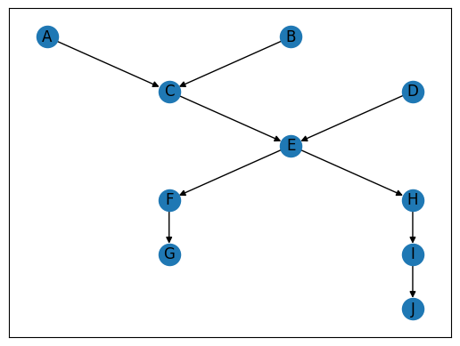

# StrGraphCpp Project
## Overview
StrGraphCpp is a project aimed at developing a graph computation system where nodes
represent string values and computations are custom defined by the user. The system models
data dependencies and computations as a Directed Acyclic Graph (DAG), similar to PyTorch but
specifically tailored for string manipulation and operations. The graph definition and
manipulation will be done in Python, while the computationally intensive backend is
implemented in C++ for efficiency.

## Environment
Ubuntu 22.04 LTS<br>Python 3.10<br>g++ 11.4.0

## Files
### StrGraphCpp.py
Define a python class to build the graph structure, node dependencies and computations

### StrEngine.cpp
The source code of core computation engine

### setup.py
A Complie script for StrEngine

### demo.ipynb
A demo show how to use this system

### ./build/lib.linux-x86_64-cpython-310/StrEngine.cpython-310-x86_64-linux-gnu.so
Complied StrEngine bin file

## Setup
create conda environment by environment.yaml and install dependent packages
```
conda env create -f environment.yaml -n strcpp
```

edit setup.py and set a right include_dirs on your system
```
include_dirs=["your_path_to/.conda/envs/strcpp/lib/python3.10/site-packages/pybind11/include"]
```

build StrEngine
```
python setup.py build
```

## How to Use
See demo.ipynb
### Define nodes and computations
```python
dag = StrGraphCpp('test')
"""
name: the node name
call: the function you want to run defined in StrEngine
input: the initial string value(Needed if the node is in first level)
param: extra paramter if the function support
"""
A = dag.addNode(name='A', call=SE.setValue, input='we')
B = dag.addNode(name='B', call=SE.setValue, input='eat')
C = dag.addNode(name='C', call=SE.concat, param=' ')
D = dag.addNode(name='D', call=SE.setValue, input='apple')
E = dag.addNode(name='E', call=SE.concat, param=' ')
F = dag.addNode(name='F', call=SE.toUpper)
G = dag.addNode(name='G', call=SE.sortLetter)
H = dag.addNode(name='H', call=SE.toLower)
I = dag.addNode(name='I', call=SE.sortWord)
J = dag.addNode(name='J', call=SE.duplicate, param=',')
```

### Define dependencies
```
A >> C >> E >> F >> G
B >> C
D >> E >> H >> I >> J
```

### See the diamgra
```
dag.show()
```


### Run
```
dag.run()
```

### See resutl
```
dag.result
```